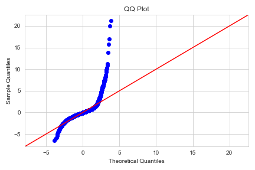
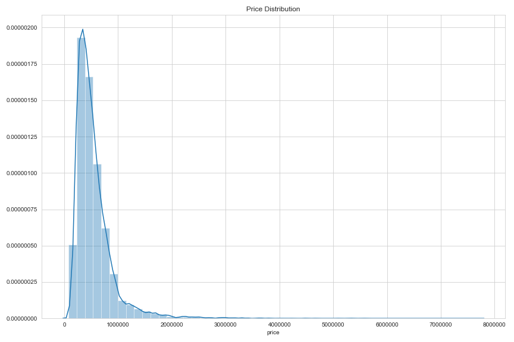
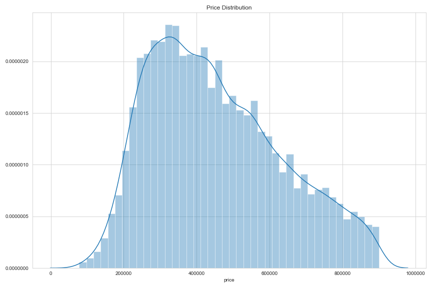
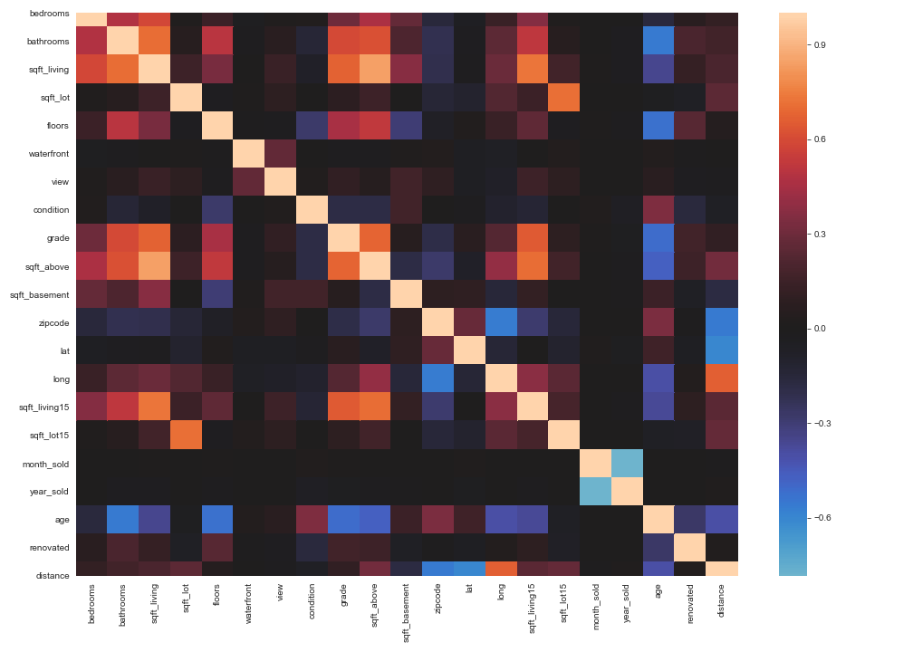
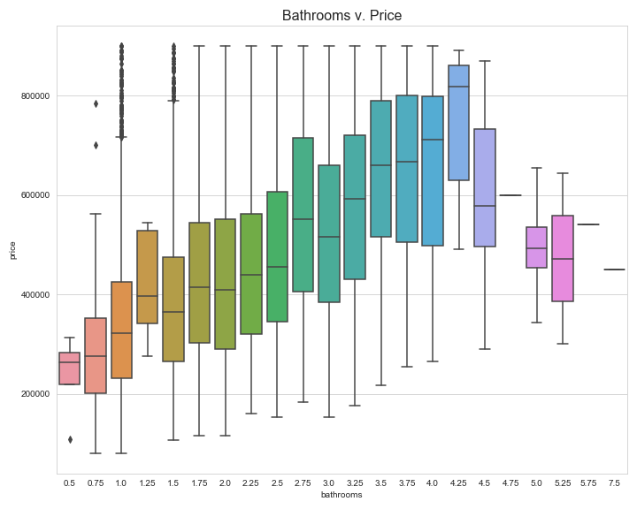
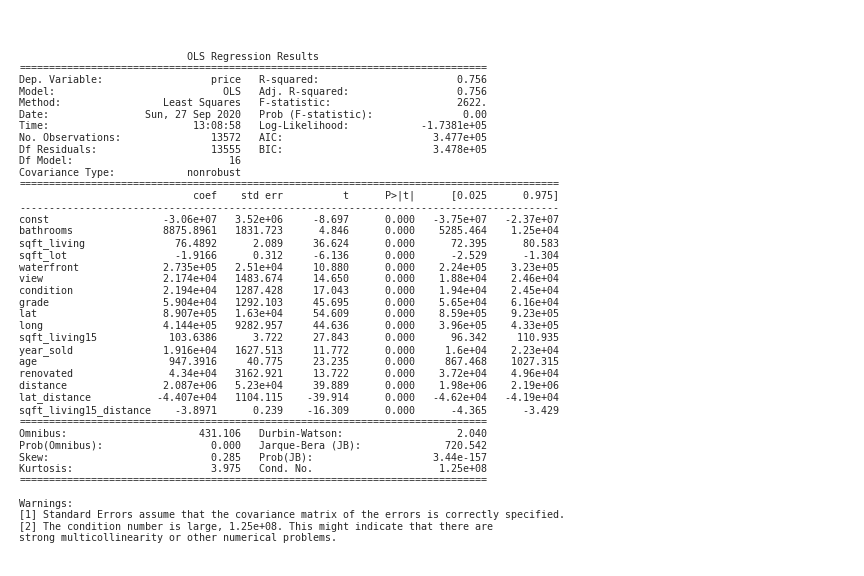

# Multiple Linear Regression: Predicting King County, WA, Housing Prices

This project involes an iterative approach to building a multiple linear regression model to predict sale prices for houses in King County, WA, utilizing data of homes sold in 2014 and 2015. The first portion of this project is spent cleaning the data (provided by Flatiron School), engineering a few new features, and then building models, tweaking each model until a final model is built. Rather than using log transformations to normalize data, I decided to keep the model as interpretable as possible, using alternative techniques to normalize residuals. As a result, I narrowed down the data to predict homes under 900k, favoring predictions for middle class families.

Below is a list of all models built and general description of changes between each model:

### 1. Model 1: Using All Features
Our first model has an adjusted r-squared of .736, but residuals were not normal, violating our assumption of normality.

### 2. Model 2: Normalizing the Dependent Variable
Removing outliers and reducing our dependent variable brought down our r-squared to .723, but our residuals are much closer to a normal distribution. There are still several insignificant p-values, but prior to dealing with those I dealt with potential multicollinearity first.

After reducing our data to prices under 900k:

### 3. Model 3: Dealing with Multicollinearity
Using a VIF (variance inflation factor), I removed two features that had a VIF using a VIF of 5 as my cutoff. After removing these features, the adjusted R squared stayed the same at .723, but there were still insignificant features.

### 4. Model 4: Removing Insignificant Features
After removing features with a p-value over 0.05, the adjusted r-squared stayed at .723. The next model deals with refining features by removing outliers.

### 5. Model 5: Refining Features
After removing outliers and removing certain features, our adjusted r-squared is now at .722. Below is showing bathrooms vs. price, and I removed homes with more than 4.5 bathrooms. There are most certainly interactions among features, so we create interaction terms in our next model.

### 6. Model 6: Dealing with Interactions
Using combinations, I created a list of top interactions, and created two interaction terms as a result of this list and rebuilt a model with an adjusted r-squared of .757. Along with sqft_lot15 being insignificant at this point, another issue was the bedrooms had a positive correlation to price but a negative coefficient, so I decided to drop this feature in order to make my model more interpretable.

### 7. Model 7: Final Model
After dropping bedrooms and sqft_lot15, the final model had an adjusted r-squared of .756, and all p-values were significant.

# Conclusion

Multiple regression analysis was used to test if certain variables significantly predicted the 
sale price of homes in King County, Washington. The results of the regression indicated that 
15 predictors and 2 interaction terms explained 75.6% of the variance (R2= 0.756, F=2470, p< 0.01). All of the independent variables used in the model were significant predictors of sale price with p-values less than 0.05. For further analysis, other models can be used to improve accuracy of results, such as a Random Forest Regression model. Additionally, one could build a second regression model to predict prices of homes over 900k.